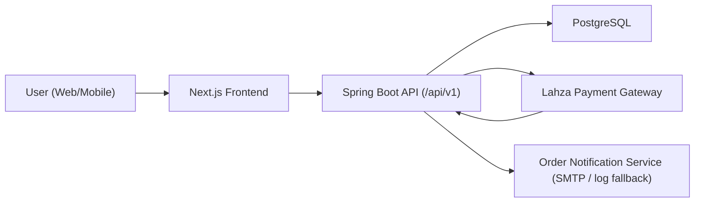

# Maie Couture E‑Commerce Platform

Production-minded full-stack e-commerce platform for a couture fashion brand, built for launch speed without sacrificing maintainability.

This repository contains:
- A Spring Boot backend (`/src`) for catalog, orders, shipping, admin, and Lahza payment integration.
- A Next.js frontend (`/frontend`) for brand experience, shopping flow, checkout, and admin-facing tools.

## Table of Contents
- [Architecture Overview](#architecture-overview)
- [Tech Stack](#tech-stack)
- [Key Features](#key-features)
- [Payment Integration Considerations](#payment-integration-considerations)
- [Shipping Workflow Logic](#shipping-workflow-logic)
- [Admin Dashboard Structure](#admin-dashboard-structure)
- [Scalability and Security Considerations](#scalability-and-security-considerations)
- [Responsive Design Decisions](#responsive-design-decisions)
- [Folder Structure](#folder-structure)
- [Screenshots](#screenshots)
- [My Role / Contributions](#my-role--contributions)
- [Challenges and Solutions](#challenges-and-solutions)
- [Run Locally](#run-locally)
- [Environment Variables](#environment-variables)
- [API Overview](#api-overview)
- [Roadmap](#roadmap)

## Architecture Overview



Core flow:
1. User browses catalog and adds products to cart (client-side cart state).
2. Frontend creates order via backend (`/public/orders`).
3. Backend computes shipping + total and stores order.
4. Frontend initializes Lahza via backend (`/public/payments/lahza/initialize`).
5. Backend verifies callback/reference and updates payment + order status.
6. Notification service sends order/payment/shipping emails.

## Tech Stack

### Backend
- Java 21
- Spring Boot 3.3
- Spring Data JPA
- Spring Security (admin basic auth)
- Flyway migrations
- PostgreSQL
- Maven

### Frontend
- Next.js 16 (App Router)
- TypeScript
- Tailwind/CSS utility styling
- Local storage cart
- i18n support (EN/AR locale handling)

### Integrations
- Lahza payment gateway (server-side initialization + verification)
- SMTP-compatible mail provider (optional, with safe fallback logging)

## Key Features

- Public product catalog with categories, variants, and product detail.
- Purchase mode per product:
  - `DIRECT_PURCHASE`
  - `APPOINTMENT_ONLY`
  - `INQUIRE_ONLY`
- Product lifecycle states (`EVERGREEN`, `LIMITED`, `NEW`, `SOLD_OUT`, `ARCHIVED`).
- Checkout with shipping quote and final total calculation.
- Lahza payment initialization + callback/verification flow.
- Admin APIs for:
  - categories
  - products + images + variants
  - orders + payment/order status updates
  - custom appointment requests
- Bulk admin price adjustment endpoint for launch pricing changes.
- Order notification pipeline:
  - order received
  - payment confirmed
  - order shipped

## Payment Integration Considerations

- Payment is initialized **server-side only**; frontend never handles secrets.
- Lahza secret key is kept in environment variables.
- Callback + reference verification is backend-controlled before marking paid.
- Order/payment statuses are normalized in backend domain model.
- Local development supports mock flow when `LAHZA_ENABLED=false`.
- Currency submitted to Lahza is enforced by backend mapping logic (ILS for local shekel flow).

## Shipping Workflow Logic

- Shipping is calculated at order creation time in backend.
- Final total formula:
  - `total = subtotal + shippingFee`
- Shipping strategy supports:
  - domestic fee
  - international fee
  - fallback fee
  - country-specific overrides (`country-fees` map)
- Shipping quote endpoint allows checkout UI to display shipping before payment.

## Admin Dashboard Structure

Admin capabilities are backed by secured `/admin/*` APIs:

- `AdminCategoryController`
  - CRUD categories
- `AdminProductController`
  - CRUD products
  - bulk price adjustment endpoint
- `AdminOrderController`
  - list orders
  - update `orderStatus` / `paymentStatus`
- `AdminCustomRequestController`
  - view and process appointment/custom requests
- `AdminAuthController`
  - identity/health check for admin session

## Scalability and Security Considerations

- Layered service structure keeps domain logic centralized and reusable.
- Flyway manages schema history for predictable deployments.
- Strong server-side validation (request DTO + service guards).
- CORS controlled via environment-based allow-list.
- Admin routes protected by Spring Security.
- Payment flow never trusts frontend success alone.
- Domain states (`PaymentStatus`, `OrderStatus`, `ProductStatus`) reduce implicit logic.
- Ready for next step hardening:
  - token-based admin auth (JWT/session)
  - rate limiting
  - audit logs
  - queue/async notifications
  - caching and pagination at scale

## Responsive Design Decisions

- Mobile-first shopping and checkout experience.
- Cart/checkout designed for small screens with readable spacing and touch targets.
- Locale-aware UI (EN/AR) with numeric formatting controls.
- Category discovery and product cards optimized for quick visual browsing.
- Components structured for gradual UX iteration without rewriting core flows.

## Folder Structure

```text
maie couture/
├── src/
│   └── main/
│       ├── java/com/maiecouture/store/
│       │   ├── admin/              # admin auth + bootstrap
│       │   ├── category/           # category domain + controllers
│       │   ├── product/            # products, images, variants, pricing tools
│       │   ├── order/              # checkout, shipping, order states
│       │   ├── payment/            # Lahza initialization/verification
│       │   ├── customrequest/      # appointment / inquiry requests
│       │   ├── notification/       # order email notifications
│       │   ├── config/             # security, cors, properties
│       │   └── common/             # error handling and shared utilities
│       └── resources/
│           ├── application.yml
│           └── db/migration/       # Flyway SQL migrations
├── frontend/
│   ├── src/app/                    # Next.js routes/pages
│   ├── src/components/             # reusable UI components
│   ├── src/lib/                    # API client, cart, i18n, currency helpers
│   └── public/                     # static media assets
├── data/
│   ├── templates/                  # CSV templates
│   └── import/                     # cleaned + ready import payloads
└── scripts/                        # data preparation/import scripts
```

## Screenshots

> Add your current UI captures here before publishing your GitHub repo.

### Home / Hero
`docs/screenshots/home-hero.png`

### Product Detail
`docs/screenshots/product-detail.png`

### Checkout
`docs/screenshots/checkout.png`

### Admin
`docs/screenshots/admin-products.png`

> Recommended: create `/docs/screenshots` and commit optimized PNG/JPG files.

## My Role / Contributions

I led the end-to-end build and integration across backend + frontend:
- Designed domain model for couture commerce (direct purchase + appointment-led products).
- Implemented backend APIs for catalog, orders, shipping, custom requests, and admin operations.
- Integrated Lahza payment initialization and verification flow.
- Built shipping fee logic with country-based overrides and total calculation.
- Implemented admin pricing operations (bulk percentage adjustment).
- Added order lifecycle notifications (received / paid / shipped) with SMTP-ready setup.
- Shaped frontend experience for luxury fashion browsing, localized UX, and mobile checkout.
- Created data import templates and payload scripts to migrate from previous platform exports.

## Challenges and Solutions

- **Challenge:** Payment status trust from client redirect.
  - **Solution:** Backend reference verification and status transitions in server domain logic.
- **Challenge:** Mixed product business rules (view-only vs purchasable).
  - **Solution:** Explicit `purchaseType` and `productStatus` enums with service-level guards.
- **Challenge:** Shipping variability by destination.
  - **Solution:** Configurable country override map + fallback fee strategy.
- **Challenge:** Launch-time repricing needs.
  - **Solution:** Admin bulk price adjustment endpoint with safe percentage math.
- **Challenge:** Missing SMTP in dev/test.
  - **Solution:** Notification service gracefully logs instead of breaking order flow.

## Run Locally

### Backend
```bash
cd <project-root>
mvn spring-boot:run
```

### Frontend
```bash
cd <project-root>/frontend
npm install
npm run dev
```

Backend base URL: `http://localhost:8080/api/v1`  
Frontend URL: `http://localhost:3000`

## Environment Variables

### Core
- `DB_URL`
- `DB_USERNAME`
- `DB_PASSWORD`
- `CORS_ALLOWED_ORIGINS`

### Admin seed
- `ADMIN_SEED_EMAIL`
- `ADMIN_SEED_PASSWORD`

### Shipping
- `SHIPPING_DOMESTIC_COUNTRY_CODE`
- `SHIPPING_DOMESTIC_FEE`
- `SHIPPING_INTERNATIONAL_FEE`
- `SHIPPING_FALLBACK_FEE`
- `SHIPPING_FEE_PS`, `SHIPPING_FEE_IL`, `SHIPPING_FEE_JO`, etc.

### Lahza
- `LAHZA_ENABLED`
- `LAHZA_BASE_URL`
- `LAHZA_SECRET_KEY`
- `LAHZA_CALLBACK_URL`

### Notifications
- `ORDER_EMAIL_ENABLED`
- `ORDER_EMAIL_FROM`
- `ORDER_EMAIL_FROM_NAME`
- `ORDER_EMAIL_REPLY_TO`
- `MAIL_HOST`
- `MAIL_PORT`
- `MAIL_USERNAME`
- `MAIL_PASSWORD`

## API Overview

Base path: `/api/v1`

### Public
- `GET /public/categories`
- `GET /public/products`
- `GET /public/products/{slug}`
- `POST /public/custom-requests`
- `POST /public/orders`
- `POST /public/shipping/quote`
- `POST /public/payments/lahza/initialize`
- `POST /public/payments/lahza/callback`
- `GET /public/payments/lahza/verify?reference=...`

### Admin
- `GET /admin/auth/me`
- `GET /admin/categories`
- `POST /admin/categories`
- `PUT /admin/categories/{id}`
- `DELETE /admin/categories/{id}`
- `GET /admin/products`
- `POST /admin/products`
- `PUT /admin/products/{id}`
- `DELETE /admin/products/{id}`
- `POST /admin/products/price-adjustment`
- `GET /admin/orders`
- `PATCH /admin/orders/{id}/status`
- `GET /admin/custom-requests`
- `PATCH /admin/custom-requests/{id}/status`

## Roadmap

- Move admin auth from basic auth to token/session flow.
- Add pagination/sorting and search ranking.
- Add media management workflow (CDN/object storage).
- Add Docker compose for one-command local boot.
- Add CI checks (lint/test/build) and staging deploy pipeline.
